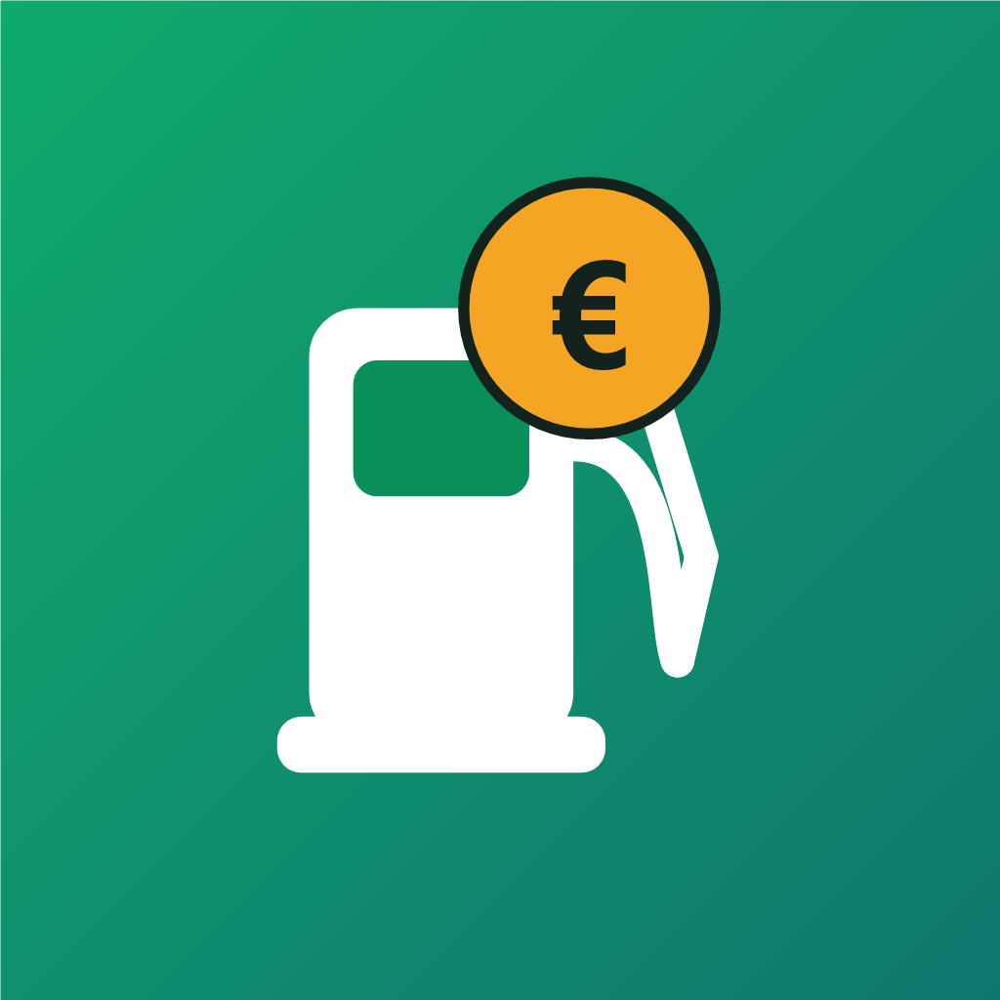
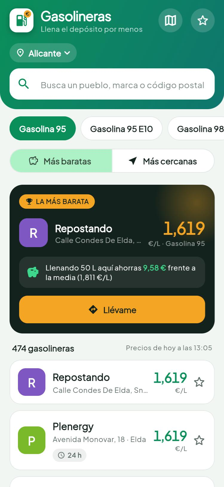
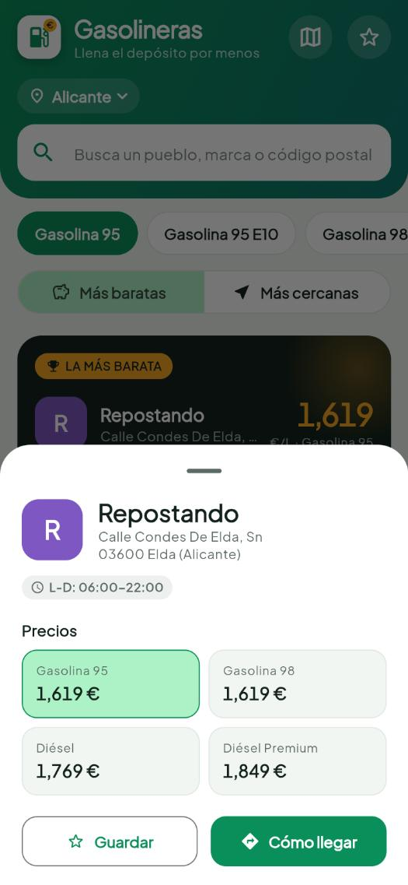
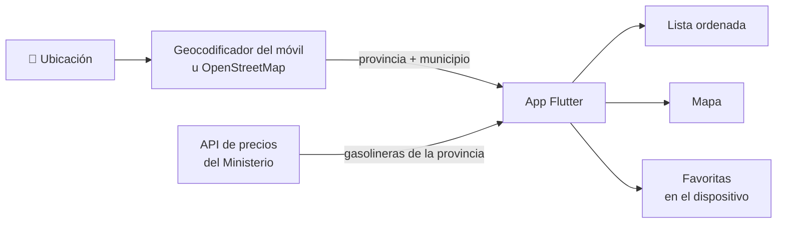

<div align="center">



# Gasolineras

**Llena el depósito por menos.**
Encuentra la gasolinera más barata de tu pueblo con precios oficiales actualizados.

[](https://github.com/Carlosss05/Gasolineras/releases/latest)
[](https://github.com/Carlosss05/Gasolineras/actions/workflows/pages.yml)
[](https://github.com/Carlosss05/Gasolineras/actions/workflows/android.yml)


### [🌐 Abrir la app web](https://carlosss05.github.io/Gasolineras/) &nbsp;·&nbsp; [📱 Descargar para Android](https://github.com/Carlosss05/Gasolineras/releases/latest)

</div>

<p align="center">
  
  &nbsp;&nbsp;
  
</p>

---

## ✨ Qué hace

| | |
|---|---|
| 📍 **Tu pueblo, automáticamente** | Detecta dónde estás y muestra las gasolineras de tu municipio (Calpe, Elche…). Cambia sola al moverte. |
| 🏆 **La más barata, destacada** | Te dice cuánto ahorras llenando 50 L frente a la media de la zona, con un botón para ir directamente. |
| ⏱️ **Precios al momento** | Datos oficiales del Ministerio para la Transición Ecológica, que se actualizan cada ~30 min. La app los refresca sola. |
| ↕️ **Ordena como quieras** | De más barata a más cara, o por cercanía. Las distancias se recalculan mientras te desplazas. |
| 🗺️ **Mapa** | Etiquetas con el precio, de verde (barata) a rojo (cara). Se ven más a medida que te acercas. |
| 🔎 **Busca en toda España** | Pueblo, marca o código postal. Si está en otra provincia, te sugiere ir allí («Calpe/Calp · Alicante»). |
| ⭐ **Favoritas** | Guarda tus gasolineras habituales y consulta su precio de hoy aunque estén en otra provincia. |
| ⛽ **7 combustibles** | Gasolina 95, 95 E10, 98, Diésel, Diésel Premium, GLP y GNC. |
| 🌙 **Modo claro y oscuro** | Según el ajuste de tu móvil. |

## 📲 Instalación

**iPhone (y cualquier móvil):** abre **[carlosss05.github.io/Gasolineras](https://carlosss05.github.io/Gasolineras/)** en Safari, pulsa *Compartir → Añadir a pantalla de inicio* y se abrirá como una app a pantalla completa. Funciona también **sin conexión**, con los últimos precios descargados.

**Android:** descarga el `.apk` de la **[última versión](https://github.com/Carlosss05/Gasolineras/releases/latest)** y ábrelo. La primera vez Android te pedirá permitir instalar apps desde el navegador. Las actualizaciones se instalan encima sin perder tus favoritas.

## 🧭 Cómo funciona



1. La app obtiene tu posición y averigua la **provincia y el municipio**, con el geocodificador del sistema o con OpenStreetMap (Nominatim) en la web.
2. Descarga las gasolineras de tu provincia de la **API pública del Ministerio** (unos 200 KB) y filtra las de tu pueblo.
3. Ordena por precio o distancia, y recalcula las distancias cada 100 m que te mueves.
4. Recuerda la última zona para que, al volver a abrirla, los precios salgan al instante.

## 🏗️ Arquitectura

```
lib/
├── data/       FuelPriceRepository (interfaz) · MineturRepository (API del Ministerio, con caché)
├── models/     Station · FuelType · Province, Community, Municipality, SearchScope
├── services/   LocationService (GPS, provincia y municipio)
├── state/      StationsController · FavoritesController (provider)
├── ui/         Pantallas, mapa, tema (theme.dart) e insignias de marca
└── utils/      Normalización de textos (búsquedas sin tildes)
```

- **Preparada para escalar.** La interfaz solo depende de `FuelPriceRepository`. Para usar un backend propio (caché compartida, histórico de precios, alertas…) basta con añadir otra implementación.
- **Rápida con datos grandes.** Toda España son unas 12.000 gasolineras (12 MB): se procesan fuera del hilo de la interfaz y el mapa solo dibuja las etiquetas visibles.

### Tecnologías

[Flutter](https://flutter.dev) · [provider](https://pub.dev/packages/provider) · [flutter_map](https://pub.dev/packages/flutter_map) · [geolocator](https://pub.dev/packages/geolocator) · [geocoding](https://pub.dev/packages/geocoding) · [shared_preferences](https://pub.dev/packages/shared_preferences) · [google_fonts](https://pub.dev/packages/google_fonts) (Plus Jakarta Sans)

## 🛠️ Desarrollo

Requisitos: [Flutter](https://docs.flutter.dev/get-started/install) 3.41 o superior.

```bash
flutter pub get
flutter run              # en un móvil conectado o un emulador
flutter run -d chrome    # versión web
flutter test             # tests unitarios
```

### Calidad: rendimiento y seguridad

```bash
flutter test test/performance_test.dart --reporter expanded   # tiempos con datos de toda España
flutter test test/security_test.dart                          # 22 pruebas de seguridad
dart run tool/osv_audit.dart                                  # vulnerabilidades conocidas en dependencias
```

- **Rendimiento:** procesar las 12.000 gasolineras de España tarda ~130 ms en el navegador; ordenar o buscar, menos de 6 ms por tecla. Las medidas tienen límites y fallan si algo se vuelve lento ([tool/benchmarks.dart](tool/benchmarks.dart)).
- **Seguridad:** los datos de la API y lo guardado en el móvil se validan (precios, coordenadas, tamaños); la web tiene una *Content Security Policy* que solo permite conectar con los servicios que usa la app; todo va por HTTPS; las claves nunca están en el repositorio.
- El workflow [Seguridad y rendimiento](.github/workflows/security.yml) lo comprueba en cada push y cada lunes.

### Publicar una versión

| Qué | Cómo |
|---|---|
| **Web** | Automático en cada push a `main` ([workflow](.github/workflows/pages.yml)). |
| **Android** | Sube `version` en `pubspec.yaml` y publica una etiqueta: `git tag v1.2.0 && git push origin v1.2.0`. El [workflow](.github/workflows/android.yml) compila el APK firmado y crea la *release*. |

El APK se firma con una clave guardada en los *secrets* del repositorio (`ANDROID_KEYSTORE_BASE64` y `ANDROID_KEYSTORE_PASSWORD`). La clave nunca se sube al código.

Para regenerar los iconos tras cambiar `assets/icon/`:

```bash
dart run flutter_launcher_icons
```

## 📄 Datos y créditos

- **Precios:** [Geoportal de Gasolineras](https://geoportalgasolineras.es/) del Ministerio para la Transición Ecológica y el Reto Demográfico ([API REST](https://sedeaplicaciones.minetur.gob.es/ServiciosRESTCarburantes/PreciosCarburantes/)).
- **Mapas y geocodificación:** © [OpenStreetMap contributors](https://www.openstreetmap.org/copyright).
- Las insignias de marca son propias, con los colores de cada marca. No se usan logotipos oficiales.
- **Tipografía:** [Plus Jakarta Sans](https://github.com/tokotype/PlusJakartaSans), licencia SIL Open Font License ([assets/google_fonts/OFL.txt](assets/google_fonts/OFL.txt)).

<div align="center">
<sub>Hecho con 💚 por <a href="https://github.com/Carlosss05">Carlosss05</a></sub>
</div>
